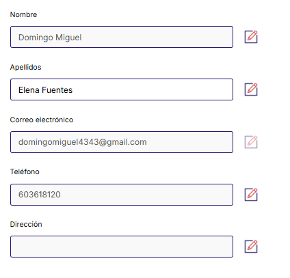
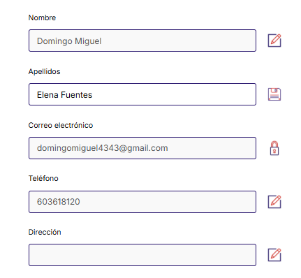
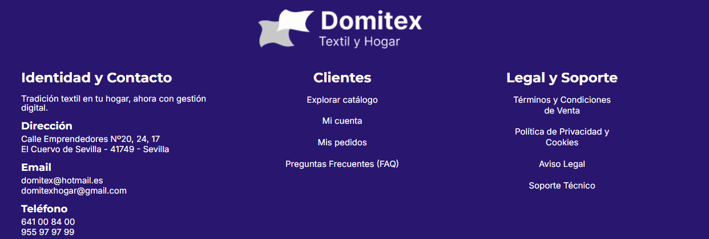
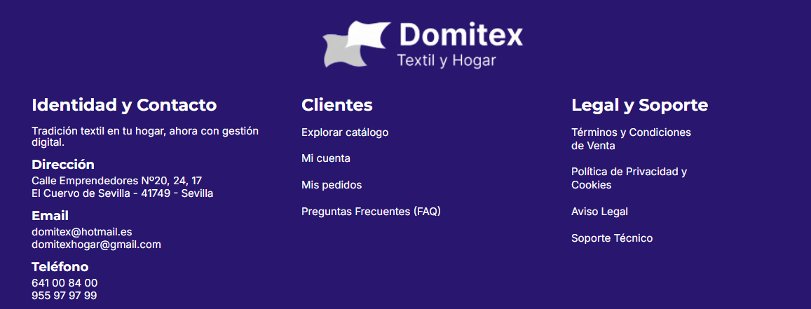
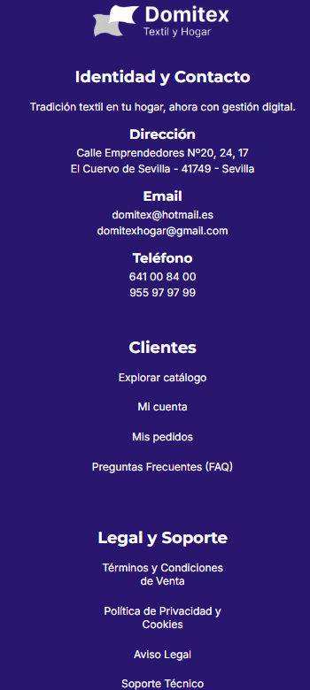
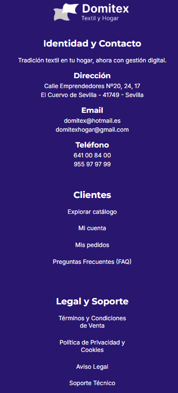

### 📝 Descripción
Implementación de diversas mejoras visuales, de interactividad y de experiencia de usuario (UX) en varios componentes principales de la aplicación.

* **Footer:**  Se ha implementado un diseño responsivo estricto: el contenido se alinea a la izquierda en pantallas grandes (PC) y se centra automáticamente en dispositivos móviles.
* **Catálogo:** Añadido un efecto de *hover* nativo (crecimiento ligero y aumento de sombra) a las tarjetas de artículos en la versión Web/PC para mejorar el *feedback* visual al pasar el ratón, utilizando el estado `hovered` de `<Pressable>`.
* **Navbar Privado:** Mejora sustancial en la usabilidad de los menús desplegables (buscador y menú de usuario). Se ha añadido una capa de fondo invisible (Overlay) que detecta los clics fuera del área activa para cerrar los menús automáticamente, imitando el comportamiento estándar de la web y apps nativas.
* **Perfil de Usuario:** Lógica visual dinámica para los campos del formulario. El icono ahora alterna de forma inteligente entre un "Lápiz" (modo lectura), un "Disquete" (modo edición/guardar) y un "Candado" (para campos bloqueados como el correo electrónico).

## 🔗 Issue relacionado
Closes #37

## 🚀 Tipo de cambio
- [ ] ✨ Nueva funcionalidad (feature)
- [ ] 🐛 Corrección de error (bugfix)
- [ ] ♻️ Refactorización (mejora de código sin añadir nueva funcionalidad)
- [X] 🎨 Mejoras de UI/UX o estilos (Tailwind / NativeWind)
- [ ] 🔧 Configuración del proyecto / Dependencias

## 📱 Cambios en la Interfaz (Si aplica)
| Antes | Después |
|  |  |
|  |  |
|  |  |
|  |  |
| *(Captura antigua o N/A)* | *(Captura nueva)* |

## ✅ Checklist de calidad antes de fusionar
- [X] He revisado mi propio código línea por línea antes de abrir esta PR.
- [X] He probado estos cambios en el emulador (Android/iOS) o en mi móvil físico con Expo Go y todo funciona correctamente.
- [X] El código compila sin errores ni advertencias (warnings) graves.
- [X] He eliminado los `console.log()` innecesarios o de depuración.
- [X] Mi código sigue la arquitectura y el estilo definido en el proyecto.
- [X] He añadido o actualizado los comentarios en funciones complejas.

## 💡 Notas adicionales para el revisor / Tutor
* Para lograr la responsividad en el Footer sin alterar la hoja de estilos (`StyleSheet`) original, las reglas de alineación (`alignItems` y `textAlign`) se han inyectado condicionalmente a nivel de componente evaluando la variable `esMovil`.
* Se ha optado por la técnica del "Overlay" (con `zIndex` y posición absoluta/fija) en el Navbar por ser la solución más robusta en React Native para emular el evento "click outside" tanto en entornos Web como móviles.