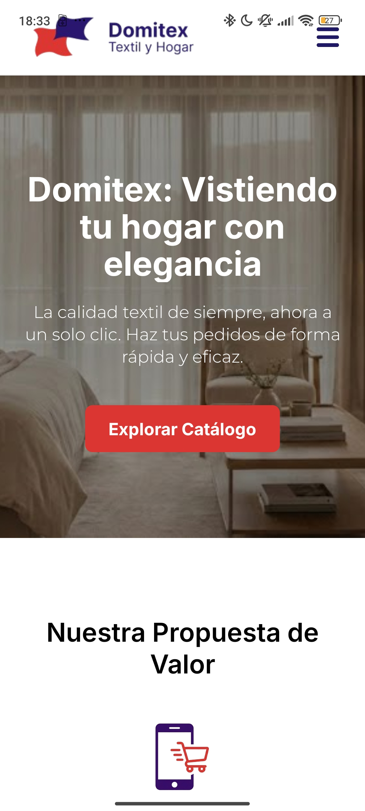

## 📝 Descripción
Creación de la página de aterrizaje (Landing Page) principal pública para el proyecto.
Se ha implementado el archivo index.tsx con las siguientes secciones:

- Banner principal con imagen de fondo (ImageBackground).
- Sección de "Nuestra Propuesta de Valor" (tres columnas con iconos).
- Sección de "¿Quiénes somos?" con texto justificado.

Además, se han construido e integrado en el _layout los componentes transversales NavbarPublico y Footer. Todo el diseño se ha hecho 100% responsivo utilizando useWindowDimensions, adaptando márgenes, tipografías y disposición (Flexbox row a column) para dispositivos móviles, e incluyendo un menú de hamburguesa funcional.
## 🔗 Issue relacionado
Closes #1

## 🚀 Tipo de cambio
- [X] ✨ Nueva funcionalidad (feature)
- [ ] 🐛 Corrección de error (bugfix)
- [ ] ♻️ Refactorización (mejora de código sin añadir nueva funcionalidad)
- [X] 🎨 Mejoras de UI/UX o estilos (Tailwind / NativeWind)
- [ ] 🔧 Configuración del proyecto / Dependencias

## 📱 Cambios en la Interfaz (Si aplica)
| Antes | Después |
| --- |  |
| --- |  |
| *(Captura antigua o N/A)* | *(Captura nueva)* |

## ✅ Checklist de calidad antes de fusionar
- [X] He revisado mi propio código línea por línea antes de abrir esta PR.
- [X] He probado estos cambios en el emulador (Android/iOS) o en mi móvil físico con Expo Go y todo funciona correctamente.
- [X] El código compila sin errores ni advertencias (warnings) graves.
- [X] He eliminado los `console.log()` innecesarios o de depuración.
- [X] Mi código sigue la arquitectura y el estilo definido en el proyecto.
- [X] He añadido o actualizado los comentarios en funciones complejas.

## 💡 Notas adicionales para el revisor / Tutor
Se ha prestado especial atención a la compatibilidad multiplataforma (Web vs Nativo). Para evitar errores en Android/iOS ("Text strings must be rendered within a <Text> component"), se han separado estrictamente los estilos de los contenedores (<Pressable>) de los estilos tipográficos (<Text>). También se ha aplicado correctamente la propiedad asChild en los <Link> de Expo Router que envuelven botones.
Para la navegación web con anclas (#quienes-somos, #contacto), se ha implementado una validación de plataforma (Platform.OS === 'web') combinada con un scroll suave nativo del navegador para evitar que la app crashee en dispositivos móviles.