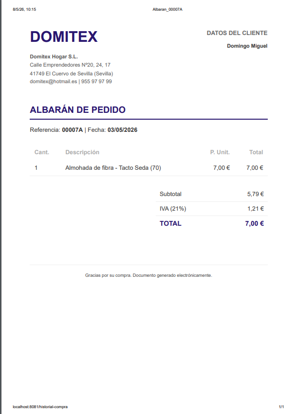

### 📝 Descripción
Se ha implementado la funcionalidad de **generación y descarga de albaranes en formato PDF** para los pedidos realizados, accesible directamente desde el historial de compras del usuario.

**Frontend (`historial-compra.tsx`):**
- **Botón de Acción:** Incorporación de un nuevo botón "Descargar albarán" en cada tarjeta de pedido, con un indicador de carga (`ActivityIndicator`) integrado para dar feedback mientras se procesa el documento.
- **Recuperación de Datos:** Desarrollo de una lógica que consulta el endpoint `/api/pedidos/{id}` para obtener el desglose completo de líneas antes de la generación.
- **Plantilla Corporativa:** Diseño de un documento HTML independiente con los colores corporativos (#29166F), que incluye el logo, los datos fiscales de Domitex (extraídos del footer) y los datos del cliente.
- **Lógica Multiplataforma:**
  - **Móvil (Android/iOS):** Generación de archivo PDF en memoria compartible mediante el menú nativo del sistema operativo.
  - **Web:** Implementación de un sistema de impresión mediante un `iframe` oculto para garantizar que se imprima únicamente el albarán y no la interfaz de la web.

**Estructura del Albarán:**
- Desglose automático de **Base Imponible** e **IVA (21%)** a partir del total del pedido.
- Tabla detallada con cantidad, descripción del artículo (nombre + medida), precio unitario y total por línea.

## 🔗 Issue relacionado
Closes #80

## 🚀 Tipo de cambio
- [X] ✨ Nueva funcionalidad (feature)
- [ ] 🐛 Corrección de error (bugfix)
- [ ] ♻️ Refactorización (mejora de código sin añadir nueva funcionalidad)
- [X] 🎨 Mejoras de UI/UX o estilos (Tailwind / NativeWind)
- [ ] 🔧 Configuración del proyecto / Dependencias

## 📱 Cambios en la Interfaz (Si aplica)
| Antes | Después |
|  ---  |     |

## ✅ Checklist de calidad antes de fusionar
- [X] He revisado mi propio código línea por línea antes de abrir esta PR.
- [X] He probado estos cambios en el emulador (Android/iOS) o en mi navegador web y los títulos cambian correctamente.
- [X] El código compila sin errores ni advertencias (warnings) graves.
- [X] He eliminado los `console.log()` innecesarios o de depuración.
- [X] Mi código sigue la arquitectura y el estilo definido en el proyecto.
- [X] He añadido o actualizado los comentarios en funciones complejas.

## 💡 Notas adicionales para el revisor / Tutor
Es necesaria la instalación de `expo-print` y `expo-sharing`. Se ha dejado preparada la constante `URL_LOGO` para enlazar el recurso gráfico definitivo desde el servidor de almacenamiento.