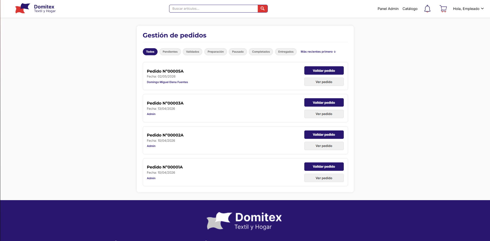
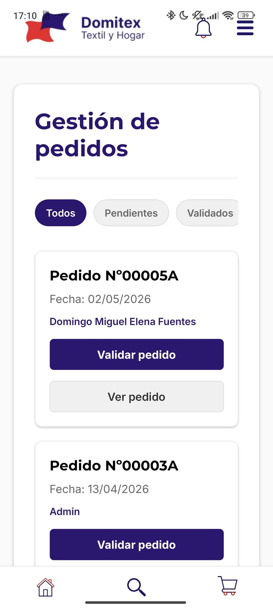
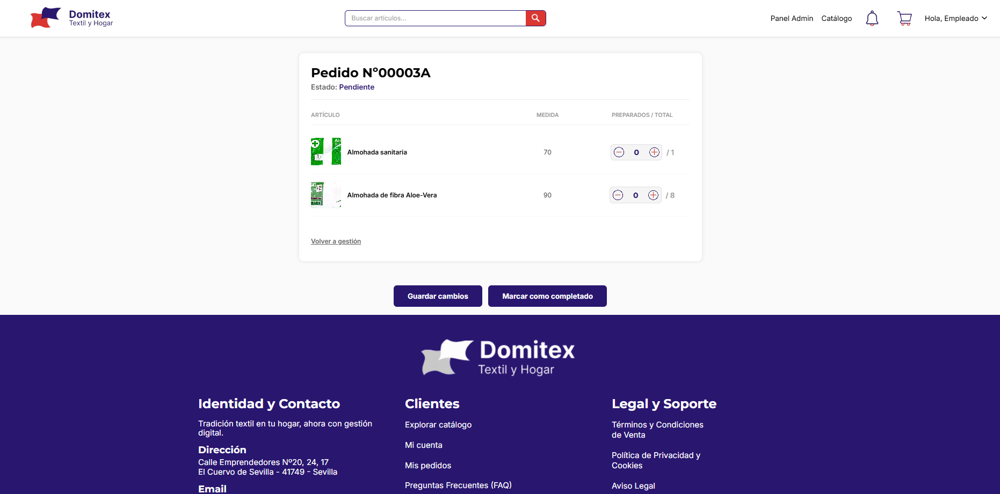
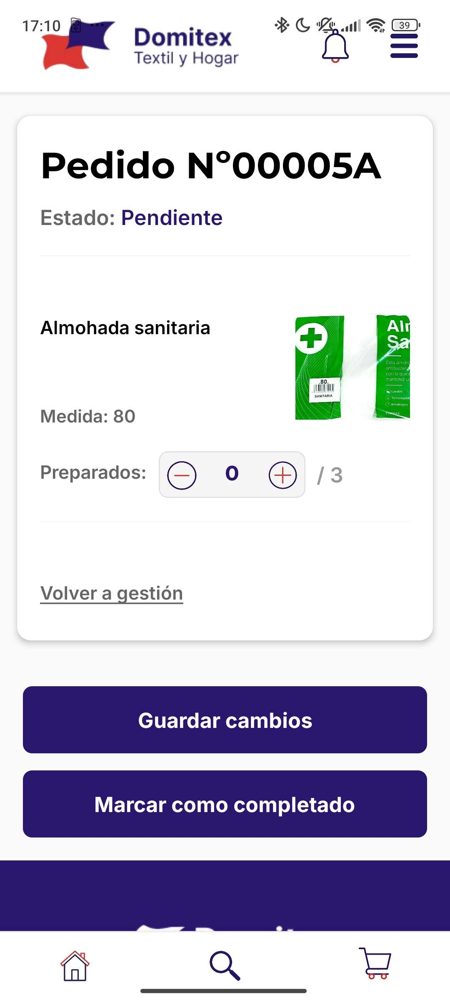

### 📝 Descripción
Implementación del flujo completo para la gestión y preparación de pedidos por parte de los administradores y empleados. Se ha desarrollado una vista general para visualizar y filtrar pedidos, y una vista de detalle para gestionar la preparación física de los artículos de cada pedido. 

**Características principales incluidas:**
*   **Pantalla de Gestión de Pedidos (`gestion-pedidos.tsx`):**
    *   Listado de pedidos en formato tarjeta con información clave (Referencia, Fecha, Cliente).
    *   Sistema de filtros por estado (Todos, Pendiente, Validado, En preparación, Pausado, Completado, Entregado) y ordenación por fecha.
    *   Flujo dinámico de botones: Botón destacado para "Validar pedido" cuando está Pendiente, que luego se transforma en un selector desplegable customizado para transicionar entre el resto de estados.
*   **Pantalla de Detalle de Preparación (`ver-pedido-admin.tsx`):**
    *   Vista detallada con las líneas del pedido.
    *   Contadores interactivos (botones `+` / `-` e `input` numérico directo) para marcar la `cantidad_servida` de cada artículo frente a la cantidad solicitada.
    *   Botones de acción superior persistentes: "Guardar cambios" (para ir guardando el progreso) y "Marcar como completado" (para finalizar el pedido).
    *   Diseño totalmente responsive, con una disposición en fila para PC y una estructura apilada adaptada para móviles (imagen a la derecha y textos a la izquierda).
*   **Backend y Base de Datos (`main.py`):**
    *   Nuevos endpoints para la obtención del listado de pedidos, detalles con las líneas y cantidades servidas.
    *   Endpoints PUT para actualizar el estado general del pedido y para actualizar simultáneamente las líneas de preparación.
*   **Autenticación y Roles (`_layout.tsx`):**
    *   Configuración del enrutamiento para permitir a los usuarios con rol `empleado` acceder exclusivamente a la gestión y validación de pedidos, restringiendo el resto del panel de administración.

## 🔗 Issue relacionado
Closes #19

## 🚀 Tipo de cambio
- [X] ✨ Nueva funcionalidad (feature)
- [ ] 🐛 Corrección de error (bugfix)
- [ ] ♻️ Refactorización (mejora de código sin añadir nueva funcionalidad)
- [X] 🎨 Mejoras de UI/UX o estilos (Tailwind / NativeWind)
- [ ] 🔧 Configuración del proyecto / Dependencias

## 📱 Cambios en la Interfaz (Si aplica)
| Antes | Después |
| --- |  |
| --- |  |
| --- |  |
| --- |  |
| *(Captura antigua o N/A)* | *(Captura nueva)* |

## ✅ Checklist de calidad antes de fusionar
- [X] He revisado mi propio código línea por línea antes de abrir esta PR.
- [X] He probado estos cambios en el emulador (Android/iOS) o en mi móvil físico con Expo Go y todo funciona correctamente.
- [X] El código compila sin errores ni advertencias (warnings) graves.
- [X] He eliminado los `console.log()` innecesarios o de depuración.
- [X] Mi código sigue la arquitectura y el estilo definido en el proyecto.
- [X] He añadido o actualizado los comentarios en funciones complejas.

## 💡 Notas adicionales para el revisor / Tutor
*   **Base de datos:** Para que el contador de preparación funcione correctamente, en la tabla `lineas_pedido` en Supabase se ha añadido la nueva columna `cantidad_servida` (tipo `int8` o `int4`, con valor por defecto `0`).
*   **Lógica de guardado:** La petición al backend en la pantalla de "Ver pedido" se realiza en segundo plano para no interrumpir la experiencia de navegación del empleado mientras escanea/prepara los artículos.