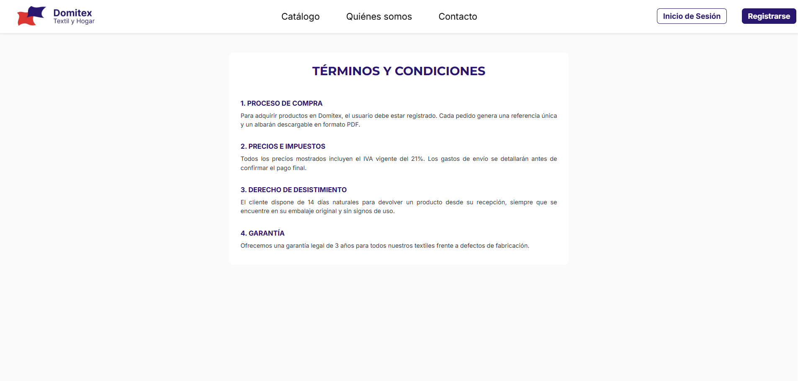
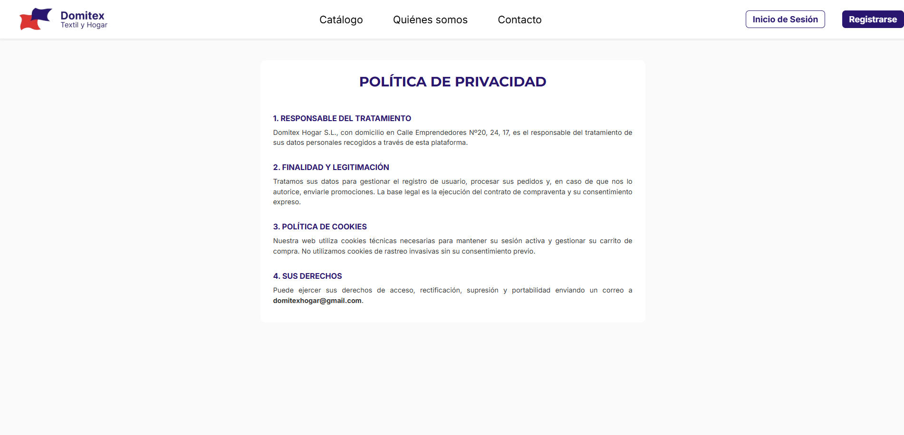
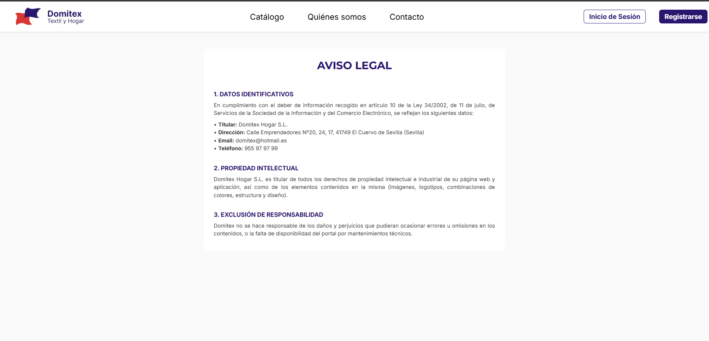

### 📝 Descripción
Se ha implementado el marco legal obligatorio para la plataforma mediante la creación de tres vistas independientes, garantizando el cumplimiento de la normativa española (LSSI-CE, RGPD y Ley de Consumidores y Usuarios).

**Componentes desarrollados:**
- **`aviso-legal.tsx`**: Expone los datos identificativos de **Domitex Hogar S.L.**, incluyendo dirección fiscal en El Cuervo de Sevilla y datos de contacto, además de las cláusulas de propiedad intelectual.
- **`privacidad.tsx`**: Describe el tratamiento de datos personales conforme al RGPD, los derechos de acceso, rectificación y supresión, y la política de cookies técnicas necesarias para el funcionamiento del carrito y la sesión.
- **`terminos-condiciones.tsx`**: Regula el proceso de compraventa, detallando la política de precios (IVA 21% incluido), el derecho de desistimiento de 14 días y la garantía legal de 3 años para productos textiles.

**Detalles técnicos y de diseño:**
- **Consistencia Visual:** Uso de las tipografías corporativas (Montserrat para títulos y Inter para cuerpo de texto) y la paleta de colores oficial (#29166F).
- **Responsividad:** Implementación de layouts adaptables mediante `useWindowDimensions` para asegurar una lectura cómoda tanto en dispositivos móviles como en escritorio.
- **SEO y Navegación:** Integración de componentes `Head` para títulos de página dinámicos y estructuras de `ScrollView` para facilitar el acceso a textos extensos.

## 🔗 Issue relacionado
Closes #83

## 🚀 Tipo de cambio
- [X] ✨ Nueva funcionalidad (feature)
- [ ] 🐛 Corrección de error (bugfix)
- [ ] ♻️ Refactorización (mejora de código sin añadir nueva funcionalidad)
- [X] 🎨 Mejoras de UI/UX o estilos (Tailwind / NativeWind)
- [ ] 🔧 Configuración del proyecto / Dependencias

## 📱 Cambios en la Interfaz (Si aplica)
| Antes | Después |
|  ---  |     |
|  ---  |     |
|  ---  |     |

## ✅ Checklist de calidad antes de fusionar
- [X] He revisado mi propio código línea por línea antes de abrir esta PR.
- [X] He probado estos cambios en el emulador (Android/iOS) o en mi navegador web y los títulos cambian correctamente.
- [X] El código compila sin errores ni advertencias (warnings) graves.
- [X] He eliminado los `console.log()` innecesarios o de depuración.
- [X] Mi código sigue la arquitectura y el estilo definido en el proyecto.
- [X] He añadido o actualizado los comentarios en funciones complejas.

## 💡 Notas adicionales para el revisor / Tutor
La información de contacto y ubicación se ha sincronizado con la declarada previamente en el componente `Footer` para mantener la coherencia informativa en toda la aplicación. Se recomienda al administrador de la base de datos verificar los NIF definitivos antes del despliegue final.