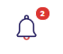
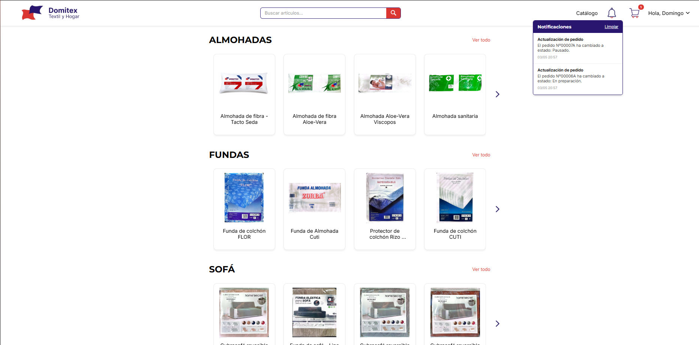
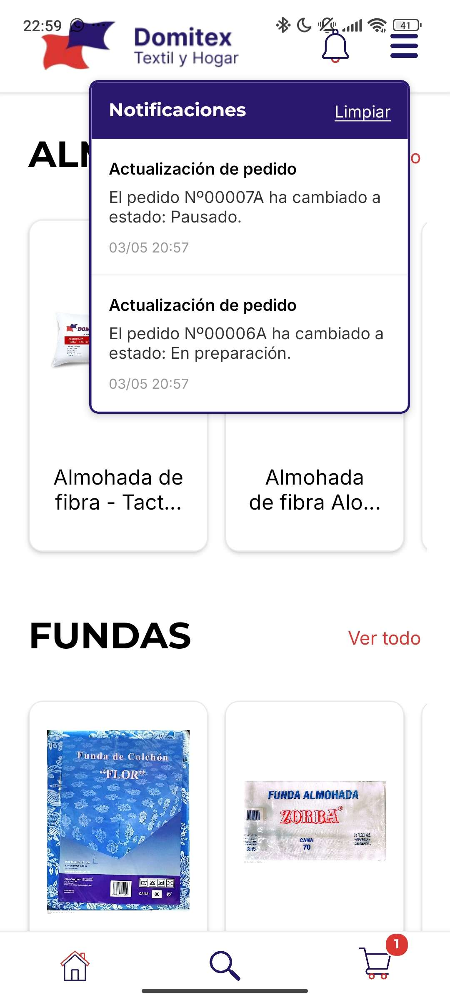

### 📝 Descripción
Esta PR implementa un sistema completo de notificaciones *in-app* para mantener a los clientes informados en todo momento sobre las actualizaciones en el estado de sus pedidos. 

**Resumen de los cambios implementados:**

*   **Backend (FastAPI & Supabase):**
    *   Modificación del endpoint `PUT /admin/pedidos/{pedido_id}/estado` para que, además de cambiar el estado, inserte automáticamente un registro en la nueva tabla `notificaciones` de Supabase asociado al cliente correspondiente.
    *   Creación de la ruta `GET /notificaciones` para obtener el historial de avisos del usuario.
    *   Creación de la ruta `PUT /notificaciones/marcar-leidas` para actualizar el estado de los avisos no leídos una vez que el usuario abre el desplegable.
    *   Creación de la ruta `DELETE /notificaciones/limpiar` para permitir al usuario borrar permanentemente su bandeja de notificaciones.
*   **Frontend (React Native / NavbarPrivado):**
    *   Implementación de un globo rojo (badge) que muestra dinámicamente la cantidad de notificaciones sin leer.
    *   Se ha construido un menú desplegable (dropdown) que lista los avisos con su título, mensaje (incluyendo la referencia del pedido) y fecha formateada. Al hacer clic en un aviso, redirige al usuario a su `/historial-compra`.
    *   Se ha añadido un botón "Limpiar" para vaciar el historial de notificaciones y mantener la base de datos y la interfaz limpias.

## 🔗 Issue relacionado
Closes #39

## 🚀 Tipo de cambio
- [X] ✨ Nueva funcionalidad (feature)
- [ ] 🐛 Corrección de error (bugfix)
- [ ] ♻️ Refactorización (mejora de código sin añadir nueva funcionalidad)
- [X] 🎨 Mejoras de UI/UX o estilos (Tailwind / NativeWind)
- [ ] 🔧 Configuración del proyecto / Dependencias

## 📱 Cambios en la Interfaz (Si aplica)
| Antes | Después |
|  |  |
| --- |  |
| --- |  |
| *(Captura antigua o N/A)* | *(Captura nueva)* |

## ✅ Checklist de calidad antes de fusionar
- [X] He revisado mi propio código línea por línea antes de abrir esta PR.
- [X] He probado estos cambios en el emulador (Android/iOS) o en mi móvil físico con Expo Go y todo funciona correctamente.
- [X] El código compila sin errores ni advertencias (warnings) graves.
- [X] He eliminado los `console.log()` innecesarios o de depuración.
- [X] Mi código sigue la arquitectura y el estilo definido en el proyecto.
- [X] He añadido o actualizado los comentarios en funciones complejas.

## 💡 Notas adicionales para el revisor / Tutor
*   **Base de Datos:** Se ha creado la tabla `notificaciones` en Supabase con las columnas: `id`, `usuario_id`, `pedido_id`, `titulo`, `mensaje`, `leida` (boolean, default false), y `fecha_creacion`.