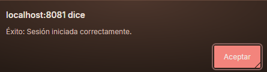
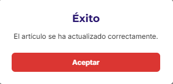

### 📝 Descripción
Se ha implementado un sistema de alertas personalizadas globales a través de un nuevo contexto (`AlertaContext`). Esto sustituye las alertas nativas del navegador y del sistema (`alert()` y `window.alert()`) en toda la aplicación, proporcionando un `Modal` reutilizable que respeta la identidad visual de Domitex (colores corporativos, tipografías y diseño de tarjetas).

**Principales cambios realizados:**
- Creación de `alerta-context.tsx` con el Provider y el diseño del Modal.
- Actualización de `_layout.tsx` para envolver el enrutador de la app con `<AlertaProvider>`.
- Refactorización general en las pantallas del sistema (`login`, `registro`, `carrito`, `gestion-pedidos`, `administrar-usuario`, `crear-usuario`, `agregar-articulo`, `vista-articulo`, `ver-pedido-admin`, `gestion-usuarios`) para consumir el contexto y usar `alerta?.mostrarAlerta()`.

## 🔗 Issue relacionado
Closes #44

## 🚀 Tipo de cambio
- [X] ✨ Nueva funcionalidad (feature)
- [ ] 🐛 Corrección de error (bugfix)
- [X] ♻️ Refactorización (mejora de código sin añadir nueva funcionalidad)
- [X] 🎨 Mejoras de UI/UX o estilos (Tailwind / NativeWind)
- [ ] 🔧 Configuración del proyecto / Dependencias

## 📱 Cambios en la Interfaz (Si aplica)
| Antes | Después |
|  |  |
|  |  |

| *(Captura antigua o N/A)* | *(Captura nueva)* |

## ✅ Checklist de calidad antes de fusionar
- [X] He revisado mi propio código línea por línea antes de abrir esta PR.
- [X] He probado estos cambios en el emulador (Android/iOS) o en mi móvil físico con Expo Go y todo funciona correctamente.
- [X] El código compila sin errores ni advertencias (warnings) graves.
- [X] He eliminado los `console.log()` innecesarios o de depuración.
- [X] Mi código sigue la arquitectura y el estilo definido en el proyecto.
- [X] He añadido o actualizado los comentarios en funciones complejas.

## 💡 Notas adicionales para el revisor / Tutor
- Se ha centralizado la lógica de notificaciones al usuario. Cualquier nueva pantalla que se desarrolle en el futuro y requiera notificar algo, simplemente debe importar y consumir el `AlertaContext` en lugar de crear un Modal desde cero o usar el alert nativo.
- El componente se ha diseñado de forma responsiva, ajustándose tanto a la vista de escritorio como a la versión móvil, manteniendo un `zIndex` y elevación altos para superponerse siempre al resto de la interfaz.