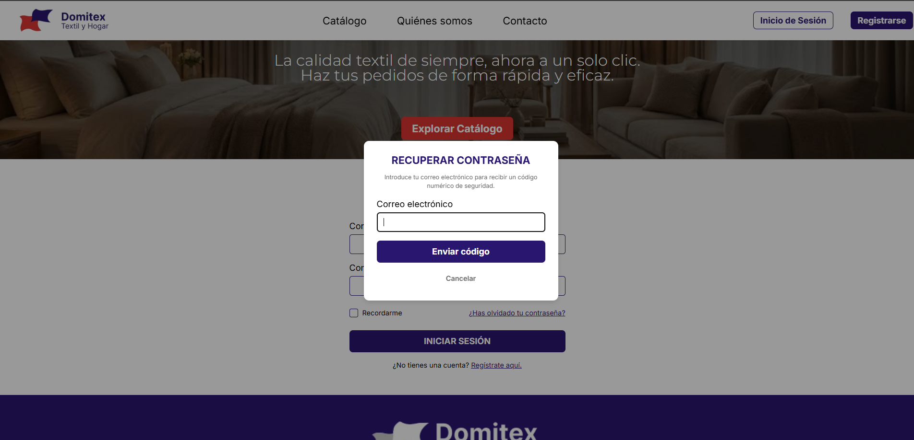

### 📝 Descripción
Se ha implementado el flujo completo de **recuperación de contraseña mediante código numérico (OTP)** para la aplicación Domitex, integrando tanto el backend, el frontend y la personalización del correo.

**Backend (`main.py`):**
- Añadidos modelos Pydantic `SolicitarRecuperacion` y `VerificarRecuperacion`.
- Creado el endpoint `/api/recuperar-contrasena` que hace uso de `auth.reset_password_for_email` de Supabase para enviar el OTP.
- Creado el endpoint `/api/verificar-recuperacion` que valida el OTP de 6 dígitos con `auth.verify_otp` y actualiza la contraseña del usuario.

**Frontend (`login.tsx`):**
- Añadido un enlace "¿Has olvidado tu contraseña?" en la pantalla de login.
- Creado un modal interactivo de dos fases:
  - **Fase 1:** Solicita el correo electrónico del usuario.
  - **Fase 2:** Solicita el código OTP de 8 dígitos recibido en el correo y la nueva contraseña.
- Se ha aplicado el fix de `fontFamily: undefined` en el input de la nueva contraseña para evitar el bug de los "puntos invisibles" (secureTextEntry) en Android.
- Añadidos indicadores de carga (`ActivityIndicator`) en los botones del modal para dar feedback visual al usuario mientras espera respuesta de la API.

**Correo Electrónico (Supabase):**
- Se ha diseñado una plantilla HTML completamente responsiva y adaptada a la identidad corporativa de Domitex (colores #29166F y #DB3632) para los correos de recuperación de Supabase.

## 🔗 Issue relacionado
Closes #79

## 🚀 Tipo de cambio
- [X] ✨ Nueva funcionalidad (feature)
- [ ] 🐛 Corrección de error (bugfix)
- [ ] ♻️ Refactorización (mejora de código sin añadir nueva funcionalidad)
- [X] 🎨 Mejoras de UI/UX o estilos (Tailwind / NativeWind)
- [ ] 🔧 Configuración del proyecto / Dependencias

## 📱 Cambios en la Interfaz (Si aplica)
| Antes | Después |
|  ---  |     |

## ✅ Checklist de calidad antes de fusionar
- [X] He revisado mi propio código línea por línea antes de abrir esta PR.
- [X] He probado estos cambios en el emulador (Android/iOS) o en mi navegador web y los títulos cambian correctamente.
- [X] El código compila sin errores ni advertencias (warnings) graves.
- [X] He eliminado los `console.log()` innecesarios o de depuración.
- [X] Mi código sigue la arquitectura y el estilo definido en el proyecto.
- [X] He añadido o actualizado los comentarios en funciones complejas.

## 💡 Notas adicionales para el revisor / Tutor
