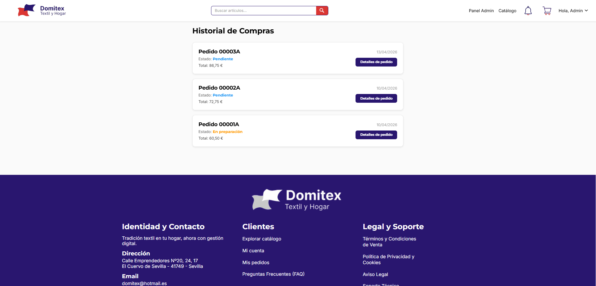
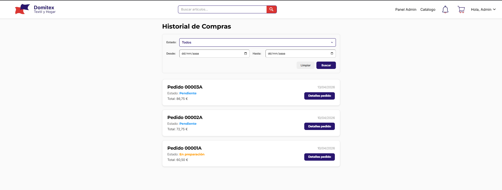
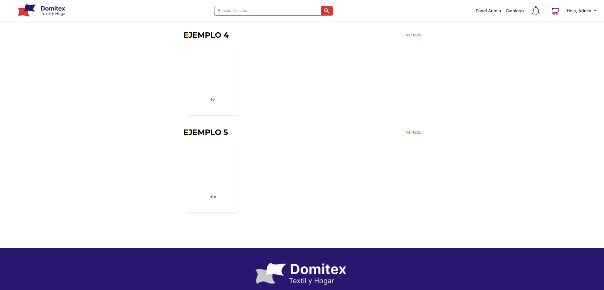
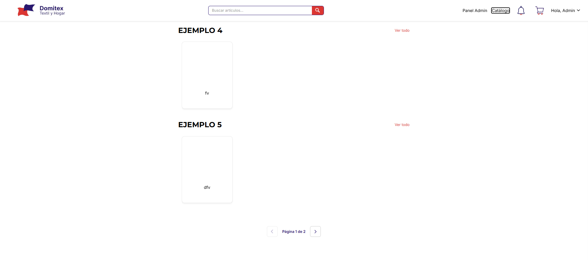
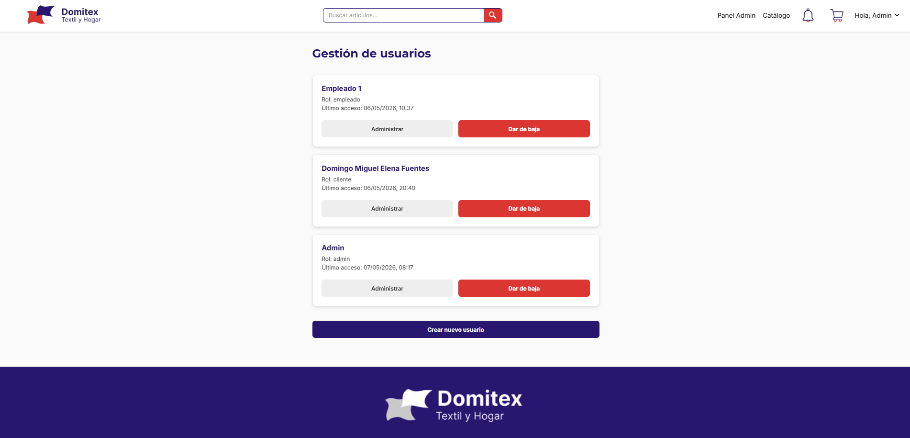
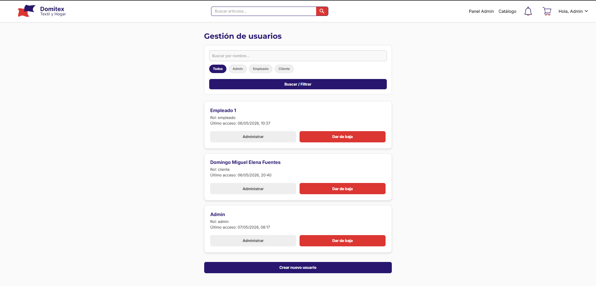
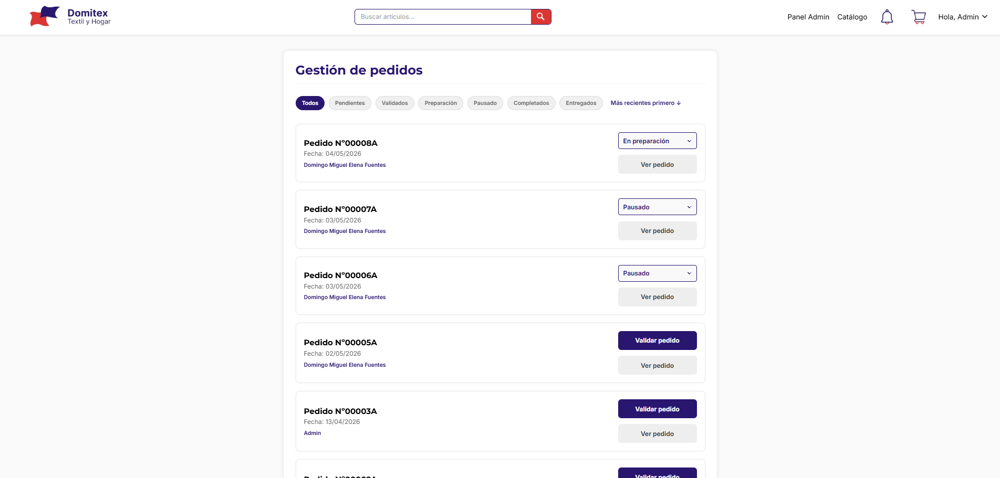
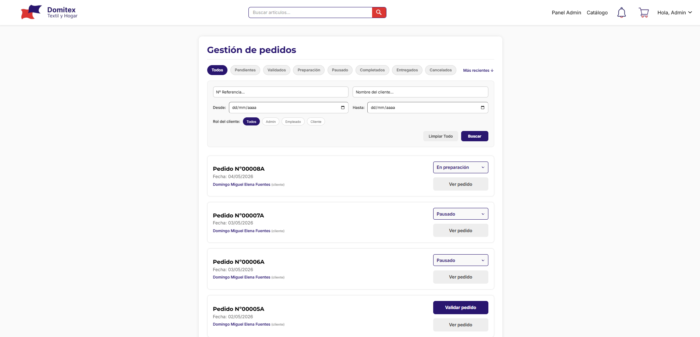

### 📝 Descripción
Esta PR implementa un sistema completo de **Paginación y Filtrado del lado del servidor (Server-Side)** en las pantallas principales de la aplicación. Se ha optimizado drásticamente el consumo de recursos tanto en el frontend como en el backend, solicitando a la base de datos únicamente los registros necesarios para la vista actual.

**Resumen de los cambios implementados:**

* **⚙️ Backend (FastAPI & Supabase):**
    * Se ha modificado la lógica de los endpoints `/articulos`, `/usuarios`, `/pedidos/historial` y `/admin/pedidos` utilizando el método `.range()` y `count="exact"` de Supabase.
    * Los endpoints ahora aceptan parámetros query de filtrado (nombre, rol, estado, fechas, referencia) y devuelven un objeto estructurado con `data` y `total_pages`.
* **📄 Paginación Dinámica (Frontend):**
    * **Catálogo:** Paginado a 8 categorías por página.
    * **Gestión de Usuarios:** Paginado a 20 usuarios por página.
    * **Gestión de Pedidos (Admin):** Paginado a 20 pedidos por página.
    * **Historial de Compras (Cliente):** Paginado a 15 pedidos por página.
    * Se han añadido controles visuales unificados de paginación (flechas e indicador de página actual) que se deshabilitan lógicamente en los límites.
* **🔍 Filtros Avanzados y UX:**
    * **Usuarios:** Búsqueda por nombre y filtrado por rol.
    * **Pedidos Admin:** Búsqueda por Nº Referencia, Nombre del cliente, Rol del cliente y Rango de fechas.
    * **Historial:** Filtrado por Estado del pedido y Rango de fechas.
    * **Cross-platform UI:** Para garantizar la máxima compatibilidad sin dependencias externas inestables, los selectores de fecha y estado renderizan componentes HTML nativos (`<input type="date">` y `<select>`) en la Web, y modales/inputs personalizados de React Native en dispositivos móviles.
    * **Colores de Estado:** Se han unificado los códigos de color para los estados de los pedidos en todas las tarjetas (Pendiente, Validado, En preparación, Pausado, Completado, Entregado y el nuevo estado **Cancelado**).
    * **Feedback visual:** Se incorporó el `ActivityIndicator` en las recargas de datos para indicar al usuario que los filtros/páginas se están procesando.

## 🔗 Issue relacionado
Closes #67

## 🚀 Tipo de cambio
- [X] ✨ Nueva funcionalidad (feature)
- [ ] 🐛 Corrección de error (bugfix)
- [X] ♻️ Refactorización (mejora de código sin añadir nueva funcionalidad)
- [X] 🎨 Mejoras de UI/UX o estilos (Tailwind / NativeWind)
- [ ] 🔧 Configuración del proyecto / Dependencias

## 📱 Cambios en la Interfaz (Si aplica)
| Antes | Después |
|    |      |
|    |      |
|    |      |
|    |      |

## ✅ Checklist de calidad antes de fusionar
- [X] He revisado mi propio código línea por línea antes de abrir esta PR.
- [X] He probado estos cambios en el emulador (Android/iOS) o en mi navegador web y los títulos cambian correctamente.
- [X] El código compila sin errores ni advertencias (warnings) graves.
- [X] He eliminado los `console.log()` innecesarios o de depuración.
- [X] Mi código sigue la arquitectura y el estilo definido en el proyecto.
- [X] He añadido o actualizado los comentarios en funciones complejas.

## 💡 Notas adicionales para el revisor / Tutor
El diseño de los filtros ha sido pensado para escalar: las peticiones de filtrado no se envían con cada pulsación de tecla (`onChangeText`), sino que están controladas por un botón explícito de "Buscar". Esto previene el sobrecargo de peticiones (Rate Limiting) a la API de FastAPI y ahorra cuota de lectura en Supabase.