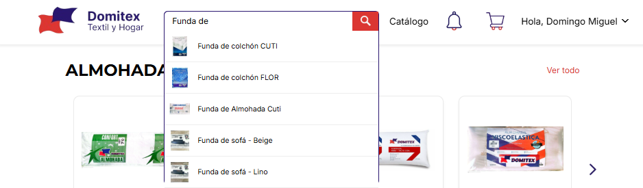
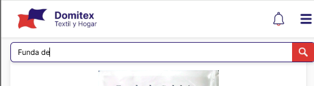
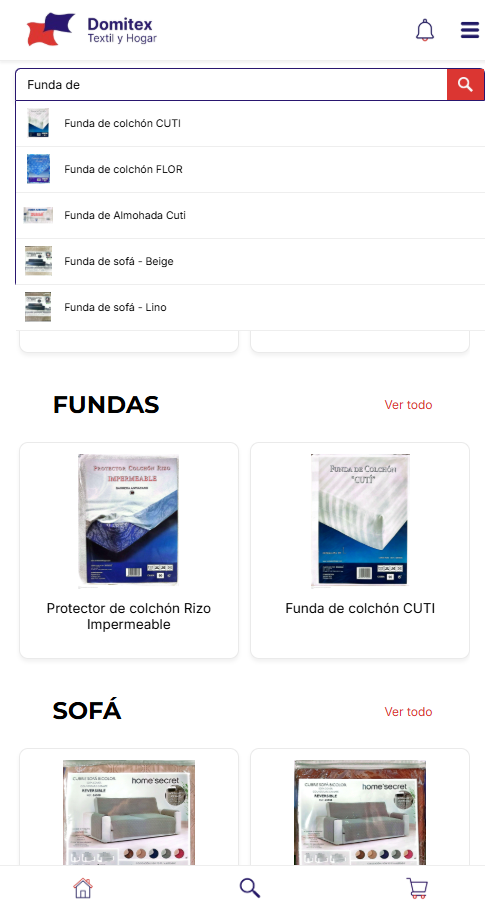

### 📝 Descripción
Implementación del motor de búsqueda predictivo en la barra de navegación y corrección de rutas en el servidor (Full-Stack).

**Frontend (React Native):**
* **Buscador Predictivo (`NavbarPrivado`):** Se ha integrado un input de búsqueda con un menú desplegable flotante (Dropdown) que muestra coincidencias en tiempo real (imagen y nombre del artículo).
* **Navegación Dinámica:** Al hacer clic en un resultado del menú, la aplicación navega directamente a la vista detallada de ese artículo (`/vista-articulo`).
* **Optimización (Debounce):** Se ha implementado un retraso de 300ms (*debounce*) en la entrada de texto para no saturar la base de datos con peticiones por cada tecla pulsada.
* **UI/UX Respetada:** El menú desplegable se adaptó con posicionamiento absoluto tanto para móvil como para web/PC, garantizando que no altere ni deforme la estructura original de la barra de navegación.

**Backend (FastAPI):**
* **Endpoint de Búsqueda:** Utiliza la función `.ilike()` de Supabase para coincidencias de texto parciales (insensibles a mayúsculas/minúsculas) con un límite de 5 resultados por consulta.

## 🔗 Issue relacionado
Closes #28

## 🚀 Tipo de cambio
- [X] ✨ Nueva funcionalidad (feature)
- [ ] 🐛 Corrección de error (bugfix)
- [ ] ♻️ Refactorización (mejora de código sin añadir nueva funcionalidad)
- [X] 🎨 Mejoras de UI/UX o estilos (Tailwind / NativeWind)
- [ ] 🔧 Configuración del proyecto / Dependencias

## 📱 Cambios en la Interfaz (Si aplica)
| Antes | Después |
|  |  |
|  |  |
| *(Captura antigua o N/A)* | *(Captura nueva)* |

## ✅ Checklist de calidad antes de fusionar
- [X] He revisado mi propio código línea por línea antes de abrir esta PR.
- [X] He probado estos cambios en el emulador (Android/iOS) o en mi móvil físico con Expo Go y todo funciona correctamente.
- [X] El código compila sin errores ni advertencias (warnings) graves.
- [X] He eliminado los `console.log()` innecesarios o de depuración.
- [X] Mi código sigue la arquitectura y el estilo definido en el proyecto.
- [X] He añadido o actualizado los comentarios en funciones complejas.

## 💡 Notas adicionales para el revisor / Tutor
* **Rendimiento Frontend:** El uso de un *timeout* (*debounce*) en el `useEffect` de la búsqueda previene llamadas innecesarias a la API, mejorando enormemente la eficiencia y reduciendo costes de lectura en la base de datos.