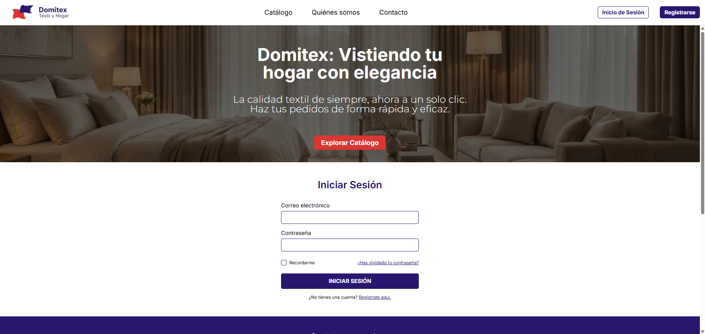
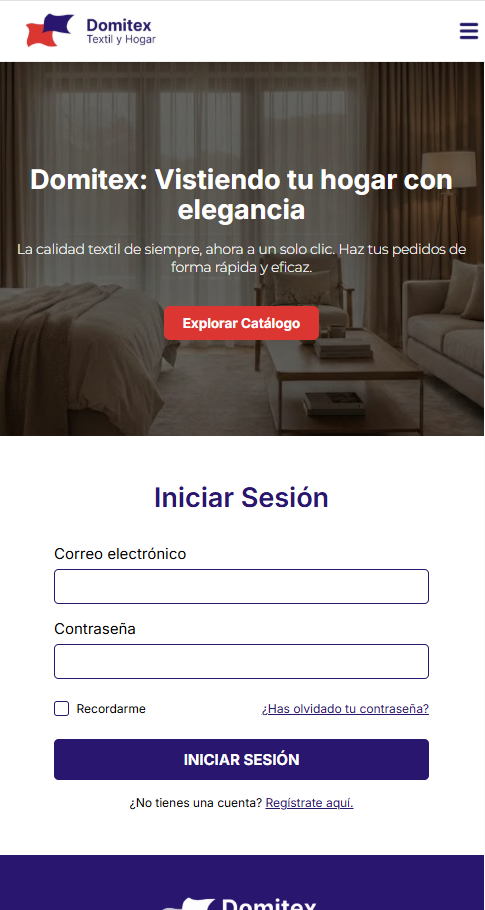

### 📝 Descripción
Se ha implementado el sistema completo de Inicio de Sesión en la aplicación. Esto incluye:
* **Frontend:** Creación de la pantalla de login responsiva con manejo de errores y conexión a la API mediante `fetch`.
* **Backend:** Nuevo endpoint en FastAPI (`POST /login`) que se conecta con Supabase Auth para validar credenciales de forma segura.
* **Sesiones:** Uso de `AsyncStorage` y React Context (`AuthContext`) para guardar la sesión localmente y evitar que el usuario tenga que loguearse cada vez que abre la app.
* **Navegación:** Renderizado dinámico de un "Navbar Privado" (con iconos corporativos, barra de búsqueda y menú desplegable) que aparece automáticamente al iniciar sesión, bloqueando además el acceso a la Landing Page pública.

## 🔗 Issue relacionado
Closes #3

## 🚀 Tipo de cambio
- [X] ✨ Nueva funcionalidad (feature)
- [ ] 🐛 Corrección de error (bugfix)
- [ ] ♻️ Refactorización (mejora de código sin añadir nueva funcionalidad)
- [X] 🎨 Mejoras de UI/UX o estilos (Tailwind / NativeWind)
- [ ] 🔧 Configuración del proyecto / Dependencias

## 📱 Cambios en la Interfaz (Si aplica)
| Antes | Después |
| --- |  |
| --- |  |
| *(Captura antigua o N/A)* | *(Captura nueva)* |

## ✅ Checklist de calidad antes de fusionar
- [X] He revisado mi propio código línea por línea antes de abrir esta PR.
- [X] He probado estos cambios en el emulador (Android/iOS) o en mi móvil físico con Expo Go y todo funciona correctamente.
- [X] El código compila sin errores ni advertencias (warnings) graves.
- [X] He eliminado los `console.log()` innecesarios o de depuración.
- [X] Mi código sigue la arquitectura y el estilo definido en el proyecto.
- [X] He añadido o actualizado los comentarios en funciones complejas.

## 💡 Notas adicionales para el revisor / Tutor
* **Seguridad delegada:** Las contraseñas no se validan a mano; se delega toda la seguridad al sistema encriptado del proveedor de identidad (Supabase Auth).
* **Trazabilidad (UML):** Se cumple estrictamente con el diagrama del proyecto al actualizar automáticamente el campo `ultimo_acceso` en la tabla pública de PostgreSQL cada vez que el usuario entra.
* **Persistencia y UX:** Usar un estado global (Context) junto con la memoria local (`AsyncStorage`) permite una experiencia de usuario (UX) fluida, cambiando la interfaz de navegación al instante y sin parpadeos.